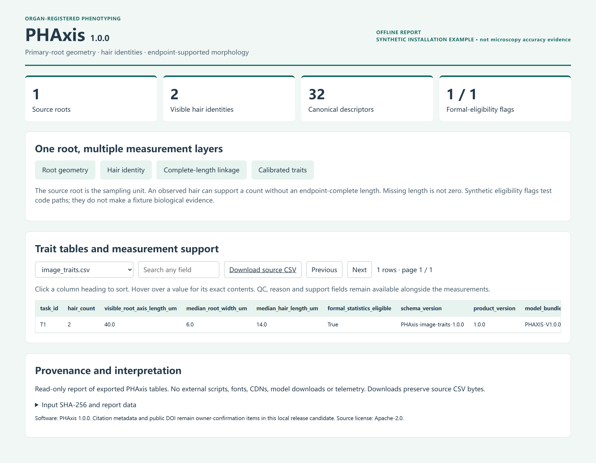

<p align="center"></p>

# PHAxis

Physically calibrated root–hair phenotyping along the primary-root axis.


[Documentation](docs/index.md) · [Quick start](#quick-start) · [Example report](docs/example/report.html) · [Citation](CITATION.cff) · [中文](README_CN.md)

PHAxis joins primary-root geometry with visible root-hair identities, links endpoint-complete lengths, and exports **32 canonical descriptors (19 root + 13 hair)** in physical coordinates. It is designed for calibrated *Arabidopsis thaliana* microscopy and source-root-level phenotyping. Its 82-column image table also carries QC and provenance; these are not 82 phenotypes.

**Public source preview.** The prepared software version is 1.0.0. This repository contains the source candidate; a stable tagged release, PyPI distribution and DOI are not yet available. Source, model weights and research data have separate release permissions. See [GitHub source status](GITHUB_SOURCE_STATUS.md).



## Quick start

Clone this standalone repository and install it in a dedicated Python environment:

```console
git clone https://github.com/707728642li/PHAxis.git
cd PHAxis
python -m pip install .
phaxis --version
phaxis demo --output demo-results
```

Open `demo-results/report.html`. The deterministic, CPU-only demo runs the real fusion and trait exporter on generated geometry: **2 visible hair identities**, separately linked complete lengths, and a second zero-hair case in the regression tests. It downloads nothing and needs no microscopy images, model weights or GPU. It is an installation/numerical test, not model-accuracy evidence.

## Models and microscopy data

The [research asset preview](https://github.com/707728642li/PHAxis/releases/tag/assets-v1.0.0-preview) provides five selected root-hair checkpoints, the primary-root model bundle, 443 HumanCurated original images with raw annotations, and 283 application images. The two image collections share 22 image hashes. Large files are release downloads, not part of a Git clone. See [contents, verification and extraction](docs/research-assets.md) and the asset-specific rights notice before use.

## Analyze microscopy images

Install `deployment` dependencies into a separate environment and obtain the separately licensed model capsule. The capsule must carry the exact five selected checkpoints, primary-root provider, calibration and sealed workflow manifest.

```console
phaxis analyze --manifest workflow.json --output results
phaxis analyze --manifest workflow.json --output results --execute
phaxis analyze --manifest workflow.json --output results --execute --resume
phaxis report --traits results/traits --output results-report
```

The first command validates inputs and prints the execution plan. Model weights are **not** embedded in the wheel; raw-image inference is not claimed to work without that capsule. See [installation](docs/installation.md), [inputs](docs/inputs.md), [outputs](docs/outputs.md) and the [full user guide](docs/phaxis/USER_GUIDE.md).

## From image to biological coordinates


The root is the biological sampling unit. Hair identity/count and endpoint-supported morphology are distinct measurements; missing length is not zero. A distal point registers position; root-cap area is not a phenotype. [Methods and evidence](docs/methods.md) explain these choices and the QC-development evaluation.

## Reproduce and contribute

```console
python -m pip install ".[test,build,docs,dev]"
python -m pytest tests/release -q
python -m build
python -m twine check --strict dist/*
python -m mkdocs build --strict
```

The archive includes input/output contracts, portable CPU tests, numerical fixtures, container/workflow recipes, supply-chain inventories and locally prepared CI. See [release preparation](docs/releasing.md), [contributing](CONTRIBUTING.md), [security](SECURITY.md), [support](SUPPORT.md) and [governance](GOVERNANCE.md).

## Citation and license

Apache-2.0 source; bundled Tomli is MIT. See [third-party notices](THIRD_PARTY_NOTICES.md). `CITATION.cff` currently uses the existing collective contributor entry. Named scholarly authors and DOI still require owner confirmation; none have been invented. Model and microscopy assets have a separate rights notice in their release.
